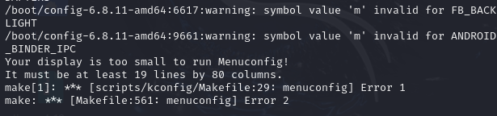

# Custom Linux Kernel Project

## Project Overview
This project involves learning and implementing the process of downloading, configuring, compiling, and installing a custom Linux kernel. The following sections document the chosen method, its justification, and the specific steps taken during the project.

---

## Methodology

### Chosen Method
I opted for **Method 1.1: Official Kernel Archive** from kernel.org for downloading the Linux kernel source code. 


### Justification for the Chosen Method
- **Reliability:** Kernel.org is the official repository for Linux kernel source code, ensuring the source is trustworthy and up-to-date.
- **Accessibility:** The official archive provides pre-compressed files that are straightforward to download and extract.

---

## Kernel Version
The project uses **Linux Kernel Version 4.19.324**, as it is stable and appropriate for learning purposes.

---


## 1.Source Code Download

### 1.1 Download Methods
1. Navigate to [kernel.org](https://www.kernel.org).

 

2. Download the archive for version 4.19.324 using `wget`:

 

### 1.2 Source Code Structure

Below is an overview of the key directories in the Linux kernel source code and their purposes:

#### 1. **arch/**
   -   Contains architecture-specific code for supported hardware platforms (e.g., x86, ARM, RISC-V).
   -  Defines architecture-dependent kernel features, including assembly code and initialization routines.

#### 2. **drivers/**
   -   Houses device drivers for hardware components such as networking, storage, graphics, and input devices.
   -  Enables kernel interaction with hardware devices.
   - **Hardware Drivers Location:** 
     - For example, drivers for USB devices can be found in `drivers/usb/`.

#### 3. **include/**
   -   Contains header files for kernel APIs and data structures.
   -  Provides interfaces and definitions shared across different parts of the kernel.

#### 4. **kernel/**
   -   Includes the core kernel code, such as process scheduling, memory management, and synchronization primitives.
   -  Implements the core functionalities of the operating system.

#### 5. **Documentation/**
   -   Offers detailed documentation on kernel development, configuration, and usage.
   -  Serves as a resource for developers and users to understand kernel features and guidelines.

#### 6. **Makefile**
   -   The top-level Makefile for building the kernel and its modules.
   -  Specifies build rules and dependencies for kernel compilation.

---

## 2.Kernel Configuration

### 1. **Meaning of `CONFIG_*` Options**
- The `CONFIG_*` options represent kernel features or modules that can be enabled, disabled, or compiled as loadable modules during configuration.
- Example:
  - `CONFIG_USB=y`: Includes USB support directly in the kernel.
  - `CONFIG_USB=m`: Compiles USB support as a module.
  - `CONFIG_USB=n`: Disables USB support.

These options are stored in the `.config` file, generated during kernel configuration.

---

### 2. **Different Option Types**
Kernel configuration options can take one of the following values:
- **`y` (yes):** The feature is built directly into the kernel.
  - Pros: Always available without requiring additional setup.
  - Cons: Increases the size of the kernel image.
- **`m` (module):** The feature is compiled as a loadable kernel module.
  - Pros: Loaded only when needed, reducing the kernel size.
  - Cons: Requires module loading and dependencies to work correctly.
- **`n` (no):** The feature is excluded from the kernel.
  - Pros: Reduces kernel size and compilation time.
  - Cons: Feature is unavailable unless the kernel is recompiled.

---
### 2.1 Understanding Configuration Options
 
### 1. Extract the Archive
Extract the downloaded file:


### 2. Navigate to the Directory
Move into the extracted kernel directory:
    ```bash
      cd linux-4.19.324

### 4. Configure the Kernel
    running kernel's configuration file
 
 


Configure the kernel using the following commands:
    ```bash
      make menuconfig

#### make menuconfig some requirements

 

  


#### Select Kernel options 


 #### Make menuconfig process

 


