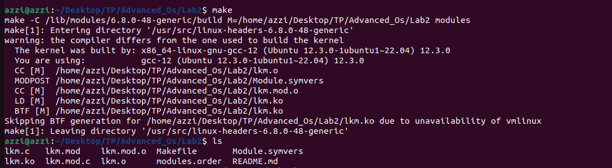
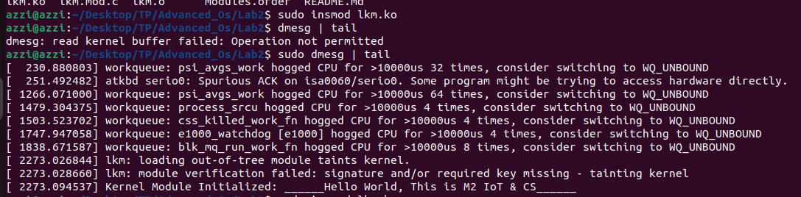
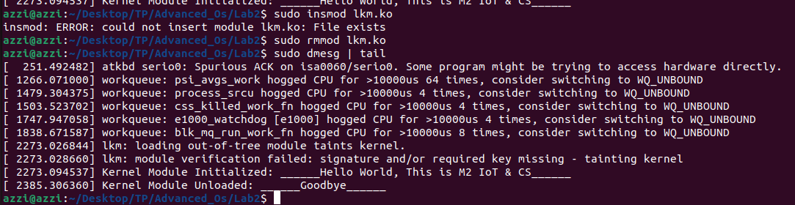

# Custom Linux Kernel Module - `lkm`

This is a simple example of a Linux kernel module (LKM) that demonstrates how to load and unload a module while printing messages to the kernel log. The module prints "Hello, World!" when loaded and "Goodbye, World!" when unloaded.

## Module Information

- **Author**: AZZI Hadjer
- **License**: GPL
- **Description**: A basic example of a Linux kernel module for demonstration purposes.
- **Version**: 0.01

## Prerequisites

- A running Linux system with kernel headers installed.
- `build-essential` and `linux-headers-$(uname -r)` packages.


To install the necessary dependencies on a Debian-based system, run:

       ```
           sudo apt update
           sudo apt install build-essential linux-headers-$(uname -r)


## Files

lkm.c: The source code for the kernel module.
Makefile: A simple makefile to compile the kernel module.

## Build Instructions
1. Navigate to the directory containing the files
   

2. Compile the module using the following command:
    

## Insert the Module into the Kernel
1. Load the module: To insert the module into the kernel, run:
2. Check kernel logs: After loading the module, check the kernel logs 
    with the following command to see the output:
    

## Remove the Module from the Kernel
1. Unload the module: To remove the module from the kernel, run:
2. Check kernel logs: After removing the module, check the kernel logs 
    again:
    


   
   


